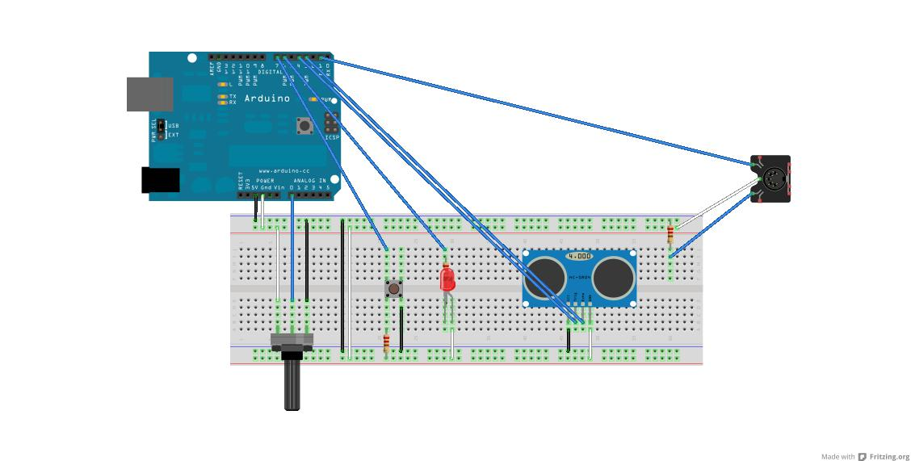

MidiMitra
=========

This projects aims to create a MIDI-Shotgun (Mitra, in italian).
When the button is pressed Arduino sends MIDI (http://en.wikipedia.org/wiki/MIDI) notes to the soundcard/syth/whatever-you-connect:
if the distance from the ultrasonic sensor changes also the note changes, with the potentiometer you can alter the output frequency.

There is also a led... but just for fun :)

The result is something really really **insane**, **noisy**, **funny** and **disturbing**

You should build your own serial-to-midi adapter in this way:

Fritzing schema:

Demo:

Based on:
http://minucci.net/blog/653
